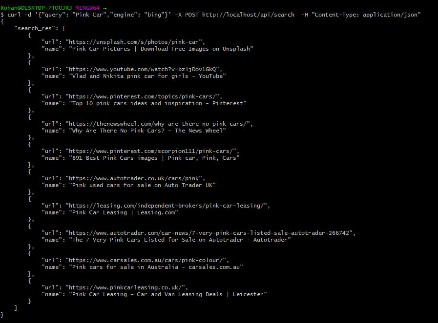

# Re-Searcher-API
This is an App to cache the search results made by APIs. 

## Development - Setup  

1. `docker-compose up --build -d`
2. `curl -d '{"query": "Pink Car","engine": "bing"}' -X POST http://localhost/api/search  -H "Content-Type: application/json"`

## Development - Production  

1. `docker-compose -f docker-compose-prod.yml up --build -d`
2. `curl -d '{"query": "Pink Car","engine": "bing"}' -X POST http://localhost/api/search  -H "Content-Type: application/json"`

## Screenshots

* CURL - Git Bash

* Docker PS

## Appendix

### Supported Engines
1. Bing API - This allows us to programmatically return search results from Bing
   
    Sample `{
            "query": "Pink Car",
            "engine": "bing"
        }`
    
    Read More 
    * https://azure.microsoft.com/en-in/services/cognitive-services/bing-web-search-api/
    * https://docs.microsoft.com/en-us/azure/cognitive-services/bing-web-search/

2. Mock API - This returns random strong and random urls, very useful for testing.   
        
    Sample `{
            "query": "Pink Car",
            "engine": "mock"
        }`
    
    Read More 
    * `app.search_api.mock_search.MockSearch`  
    

Factory allows us to add even more backends easily. - `api/app/search_api/factory.py `

### Snippets 

* `docker-compose down && docker-compose up --build -d && docker-compose logs --follow`