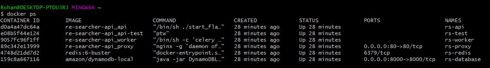

# Re-Searcher-API
This is an App to cache the search results made by APIs. 

## Setup - Development   
* Setup `.env` file, refer `.env.example` 
* `docker-compose up --build -d`

## Setup - Production  
* Setup `.prod-env` file, refer `.prod-env.example`
* `docker-compose -f docker-compose-prod.yml up --build -d`

## How to Use?  

* `curl -d '{"query": "Pink Car","engine": "bing"}' -X POST http://localhost/api/search  -H "Content-Type: application/json"`

## API Reference Docs
#### 1. Search - http://localhost/api/search

##### Request - GET
/search?query=<The Search Query> 

##### Reponse 
`{
    "search_res": [
        {
            "url": "https://unsplash.com/s/photos/pink-car",
            "name": "Pink Car Pictures | Download Free Images on Unsplash"
        }...]
}`

## AWS Setup

1. No manual setup is required on AWS, you only need to supply the correct *Key & Secret tokens* in the *.prod-env* for the user
who has the "AmazonDynamoDBFullAccess" permission.

2. Then the results are automatically written to the DynamoDB Table. 

3. The table is automatically created on AWS DynamoDB if it does not already exist. 
`Check models.utils.init_tables`

### Screenshots
Here are some screenshots on how to create a new AWS User

## Screenshots

* CURL - Git Bash

* Docker PS

## Appendix

### Supported Engines
1. Bing API - This allows us to programmatically return search results from Bing
   
    Sample `{
            "query": "Pink Car",
            "engine": "bing"
        }`
    
    Read More 
    * https://azure.microsoft.com/en-in/services/cognitive-services/bing-web-search-api/
    * https://docs.microsoft.com/en-us/azure/cognitive-services/bing-web-search/

2. Mock API - This returns random strong and random urls, very useful for testing.   
        
    Sample `{
            "query": "Pink Car",
            "engine": "mock"
        }`
    
    Read More 
    * `app.search_api.mock_search.MockSearch`  
    

Factory allows us to add even more backends easily. - `api/app/search_api/factory.py `

### Snippets 

* `docker-compose down && docker-compose up --build -d && docker-compose logs --follow`